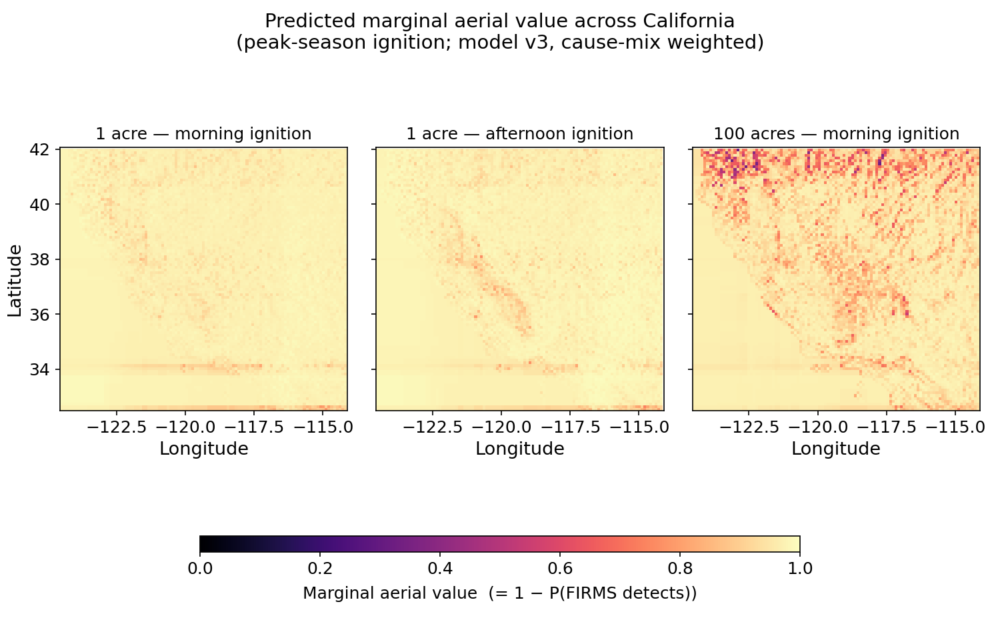
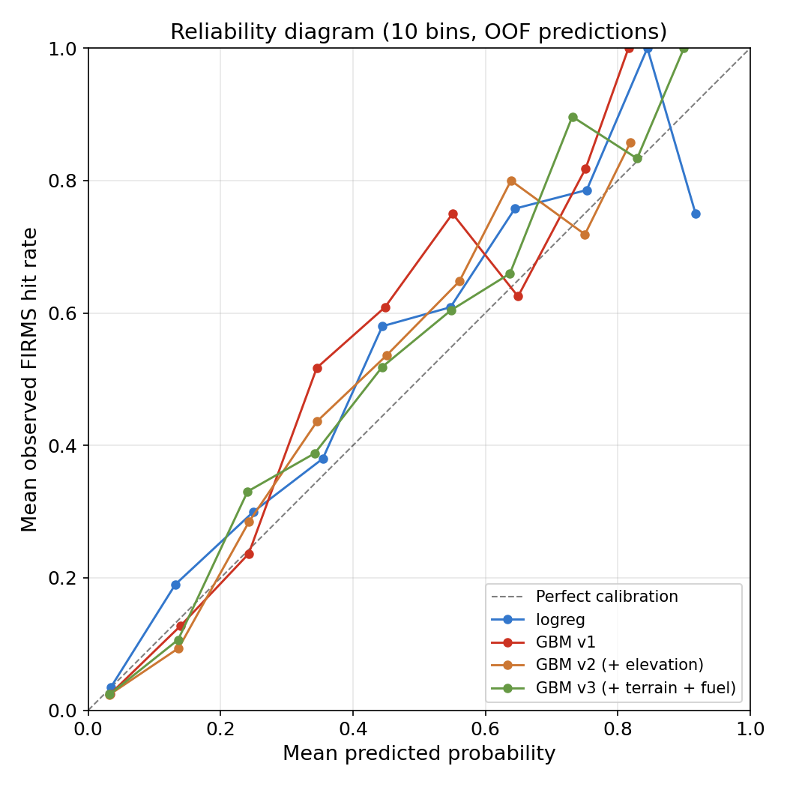
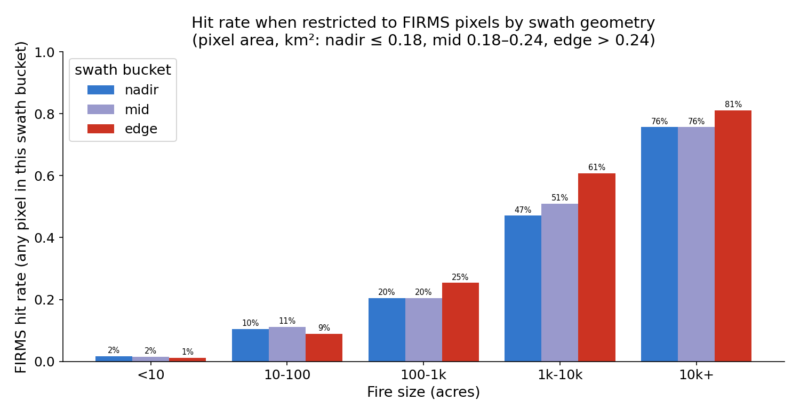
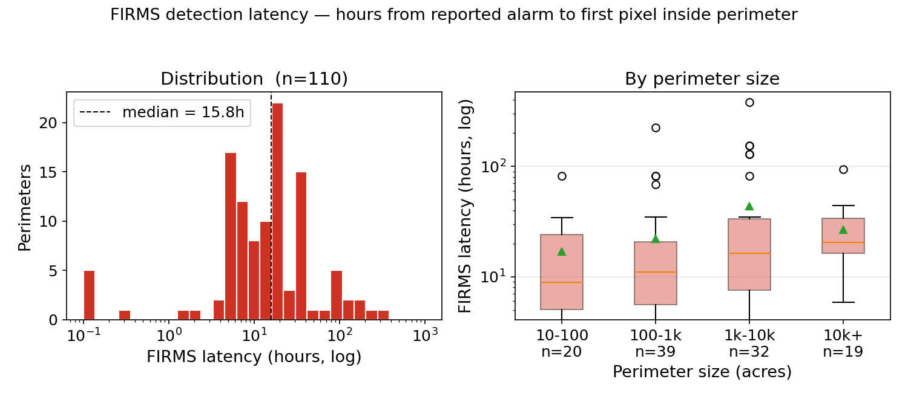

# Where does aerial wildfire detection add the most marginal value?

A deployment-economics study, not a fire-prediction study.

**Question:** Satellites (FIRMS / VIIRS VNP14) are the de-facto first line of
wildfire detection. But how often do they actually catch a fire, especially
small ones — and where in California is their silence least trustworthy?
Wherever satellite detection is unreliable is exactly where an aerial
loiter/detection platform pays for itself.

**Headline result, California, Jun–Nov 2020, ground truth = FPA-FOD (n=7,500
recorded fire events):**

| Fire size at containment | n | FIRMS detection rate |
|---|---:|---:|
| <10 acres (92.5% of all fires) | 6,939 | **3.2%** |
| 10–1,000 acres | 472 | 25.2% |
| ≥1,000 acres | 89 | 79.8% |


Translation: a California wildfire that gets *contained* under 10 acres has a
**~97% probability of never appearing in FIRMS at all**. The size of the fires
FIRMS misses *is* the addressable market for aerial early-detection.

---

## Decision impact — loiter vs. suppression

This question has the same answer for both plausible product directions:

* **If the product is loiter / early detection.** The marginal value of a
  drone over a square kilometer is approximately *1 minus* what satellites already
  catch there. The gap surface (below) is a first-pass priority map for
  where to base or patrol assets — fire-prone areas where FIRMS routinely
  misses the first 6–24 hours of fire growth.
* **If the product is active suppression.** Suppression needs a *trustworthy*
  ignition trigger. A satellite product whose silence has a ~95% false-OK rate
  for small fires cannot be the trigger. The gap surface is also the surface
  over which a confirmatory aerial confirmation layer has to operate.

In both cases the foundation is the same: a calibrated estimate of
P(satellite misses this fire | location, season, time-of-day, size).

---

## Where the gap is largest

For a hypothetical fire ignited at peak season (mid-July, mid-day local), the
trained model's predicted *marginal aerial value* (= 1 − P(FIRMS detects))
across California, after adding terrain (elevation):



* The 1-acre map is uniformly high (median 0.98) — VIIRS rarely catches small
  fires anywhere. **The lever is detecting fires that haven't grown yet.**
* For 100-acre fires (right panel) the surface separates by terrain: the
  Klamath / Trinity Alps and the northern Sierra–Cascades show high gap
  (light = FIRMS will probably miss), while the Central Valley and southern
  basins show low gap (FIRMS catches them). Detection failures concentrate
  in the heavily forested, high-elevation interior — exactly where
  ground-based detection is also hardest.

---

## Methodology

### Data sources

| Source | Used for | Records |
|---|---|---:|
| FIRMS VIIRS VNP14 (Suomi-NPP, archived `_SP`) | Satellite hot-spot detections | 233,261 pixels, CA, Jun–Nov 2020 |
| FPA-FOD v6 (USFS RDS-2013-0009.6) | Ground truth (covers small fires) | 7,500 CA Jun–Nov 2020 |
| CAL FIRE incidents API | Cross-check for large fires; latency anchor | 228 wildfires |
| NIFC InterAgency Fire Perimeter History | Burn polygons for latency + polygon-match | 566 unique CA 2020 perimeters |
| Open-Elevation (SRTM-derived) | Elevation feature + terrain derivatives | ~44k lookups (FPA + neighbors + grid) |
| LANDFIRE LF2016 FBFM40 (USGS) | Fuel-model feature | 16,909 raster samples |

Why VIIRS not MODIS: MODIS MOD14 fire mask is too stochastic to serve as the
detection product against which to compare; VIIRS VNP14 is the standard
choice in recent comparative work (cited in `start.md`).

### Matching FIRMS pixels to ground-truth fires

For each FPA-FOD fire (LAT, LON, DISCOVERY_DATE → CONT_DATE), we check whether
any FIRMS pixel falls within:
* **3 km radius** of the ground-truth coordinate (default; ~8 VIIRS pixels of
  slack to absorb FPA-FOD coordinate noise);
* the temporal window from `DISCOVERY_DATE − 1d` through
  `min(CONT_DATE, DISCOVERY_DATE + 14d)`.

The 14-day cap on containment is a defense against multi-month containment
records sweeping unrelated ignitions into the window.

The headline picture is **robust to envelope settings**:


Even at the most generous setting (5 km radius, +5 day window), small-fire hit
rate caps at 7%; the tightest setting (1.5 km, +1 day) still shows large
fires (>1k ac) at 65–72%.

### Caveats inside the comparison itself

* **"Hit" = any pixel in the envelope**, not "FIRMS correctly identified this
  fire." When two fires burn within a few km, both will be credited as hits.
* **FPA-FOD coordinates aren't perfect.** The 174k-acre Castle Fire (2020) shows
  up at 34.95°N / -118.93°W, ~120 km from the actual burn perimeter in
  Sequoia NF — that's why even the 100k+ bucket isn't 100%. Ground truth has
  noise too.
* **FPA-FOD covers 1992–2020 only.** Extension to 2021+ needs a different
  ground-truth source (MTBS, ICS-209, CAL FIRE incidents).

### Polygon vs. centroid matching

For the 268 FPA-FOD fires that fall *inside* a 2020 burn perimeter, we can
redefine the match: "FIRMS pixel inside the actual burn polygon during the
fire's active window" instead of "FIRMS pixel within 3 km of the discovery
coordinate." This isolates the cost of the centroid-radius approximation.


| Size (acres) | n inside perim | centroid+radius hit | polygon hit |
|---|---:|---:|---:|
| <10 | 146 | 13% | **38%** |
| 10–100 | 42 | 57% | 36% |
| 100–1k | 38 | 68% | 63% |
| 1k–10k | 19 | 95% | 95% |
| 10k+ | 23 | 96% | **100%** |
| **All** | **268** | **41%** | **51%** |

Two opposite effects fight each other:
* At the **small end (<10 ac)**, the polygon-based method *catches* fires that
  the centroid envelope missed — many of these are satellite ignitions
  recorded near (but not under) a 2020 mega-fire perimeter, and a FIRMS pixel
  *inside* the eventual burn polygon credibly evidences detection of that fire
  during its active window.
* At the **middle (10–1k ac)**, the polygon method is *stricter*: the centroid
  envelope was over-crediting hits from nearby fires whose pixels happened to
  be within 3 km but weren't actually inside this fire's perimeter.
* At the **top end (10k+)**, the polygon method recovers the Castle-Fire-style
  coordinate-offset cases — pushing the bucket from 96% to 100%.

Net effect: +10 pp lift on the polygon-matchable subset. The headline tables
above use the centroid-radius v1 numbers across the full 7,500 fires for
comparability with the prior literature, but the polygon-match is the more
trustworthy measurement when a perimeter exists.

---

## Modeling the gap

Target: P(FIRMS detects | fire characteristics). All metrics are 5-fold
out-of-fold; the calibrated models use `CalibratedClassifierCV(method="isotonic",
cv=5)` so the held-out probabilities are honestly calibrated.

| Model | Brier ↓ | Log-loss ↓ | AUC ↑ |
|---|---:|---:|---:|
| Predict "no" always (constant baseline) | 0.0547 | 0.755 | 0.500 |
| Train base rate | 0.0517 | 0.212 | 0.500 |
| Size-class lookup | 0.0418 | 0.171 | 0.712 |
| Size-class × lat-band lookup | 0.0422 | 0.192 | 0.750 |
| Logistic regression (calibrated) | 0.0421 | 0.171 | 0.768 |
| HistGradientBoosting (calibrated) — fire-attribute features only | 0.0381 | 0.152 | 0.838 |
| **HistGradientBoosting v2 (calibrated) — adds elevation** | **0.0367** | **0.148** | **0.844** |
| HistGradientBoosting v3 — adds slope/aspect/TPI + LANDFIRE fuel group | 0.0370 | 0.148 | 0.843 |


The size-class baseline is a **strong** baseline — it captures the dominant
signal (small fires get missed). The v1 GBM beats it by 10% on Brier and lifts
AUC from 0.75 → 0.84 using continuous size, spatial coordinates, season
(`sin_doy`/`cos_doy`), discovery time-of-day, and hours-since-overpass.
Adding **elevation** (v2) pulls Brier from 0.0381 → 0.0367 — small on the
metric, large on the spatial *shape* of the predicted gap surface.

Adding **slope, aspect (as sin/cos), TPI** (computed from neighboring
elevation queries) and the **LANDFIRE FBFM40 fuel group** in v3 does **not**
beat v2: Brier nudges back up to 0.0370 and AUC drops 0.001. Honest read:
once the model has `LATITUDE`, `LONGITUDE`, and `elevation_m`, it already
implicitly knows the local fuel/terrain signature; the explicit features are
collinear with that spatial signal at this dataset's scale. We keep v3
runnable but use v2 as the headline model.

Features (v3):
* `log10(FIRE_SIZE)`
* `LATITUDE`, `LONGITUDE`
* `elevation_m`, `slope_deg`, `aspect_sin`, `aspect_cos`, `tpi_m`
* `sin_doy`, `cos_doy` (seasonality)
* `disc_hour` (discovery hour-of-day, local; ~22% missing in FPA-FOD)
* `hours_since_overpass` (VIIRS Suomi-NPP overpasses at ~02:00 / ~14:00 local)
* `cause` (NWCG general cause; mostly "Undetermined" so weak signal)
* `fuel_group` (LANDFIRE FBFM40 collapsed to 7 classes)

### Calibration



The isotonic-calibrated GBM tracks the diagonal in the 5–25% probability range,
which is where most operational decisions sit. The GBM's points mostly lie *above*
the diagonal in the mid-probability bins (model under-predicts hit rate — i.e.
errs toward "drone is needed here," the safe direction for a detection product).
The top two probability bins each have only ~30–45 samples, so the high-confidence
end of the curve is data-limited rather than well-attested.

---

## Spatial pattern of misses

Where do the misses cluster?


Small-fire misses (left) cover the state — the lever is dwell-time on
small ignitions, not geography. Larger-fire misses (right) concentrate
along the Coast Range and the Sierra–Cascade interior, broadly where fuel
moisture is highest and overpass timing is misaligned with peak fire-spread
hours.

---

## Swath-edge geometry — pixel size matters

VIIRS scans a ~3,000 km swath. Pixels near nadir are ~375 m on a side; pixels
near the swath edge are 2–3× larger. FIRMS exposes this via the `scan` and
`track` fields (`pixel_area_km² ≈ scan × track`). We split FIRMS into nadir /
mid / edge thirds and re-ran the hit-rate calculation restricted to each:



* **Big fires (≥1k ac):** edge pixels have a *higher* hit rate (1k–10k:
  47% nadir vs **61% edge**; 10k+: 76% vs **81%**). A larger pixel covers more
  area, so any single fire is more likely to fall under one.
* **Small fires (<10 ac):** edge pixels have a *lower* hit rate (1% vs 2%).
  The same physics that helps for big fires hurts here: larger pixels have a
  higher per-pixel detection threshold, so they need a stronger thermal
  signal to fire.

This is the textbook detection-vs-resolution trade-off, visible in the data
without any model. For an aerial product, it implies that nadir-only filtering
*tightens* the FIRMS "no" signal but throws away ~70% of detections; for
small-fire alerting, ignoring edge pixels is the right call because they
contribute almost nothing.

---

## Detection latency, when FIRMS does see the fire

Hit/miss is only half the picture. For the perimeters where FIRMS *does* fire,
the operationally meaningful number is **how late**. We compute latency by
spatial-joining FIRMS pixels with the 566 CA 2020 burn perimeters (NIFC
InterAgency dataset), anchoring the fire-start time to the matched CAL FIRE
incident `Started` timestamp (or, where unavailable, a name-matched FPA-FOD
discovery point), and contamination-filtering anything where the first FIRMS
pixel inside the perimeter sits >30 days off the anchor (i.e. an unrelated
earlier fire inside what later became this perimeter).



For the 110 perimeters where we can credibly measure latency:

| | Value |
|---|---:|
| Median time from alarm to first FIRMS pixel | **15.8 h** |
| Inter-quartile range | 6.5 – 31.7 h |
| Detected within 12 h | 43% |
| Detected within 24 h | 72% |
| Detected after >48 h | 11% |

Two takeaways:
1. **For fires FIRMS catches, the median delay is ~16 hours.** Half a day to a
   full day of growth before the satellite alerts. A loiter/detection aircraft
   that closes that window is the product.
2. Latency *increases* slightly with perimeter size (median 9 h for 10–100 ac
   → 21 h for 10k+ ac). This is the expected dynamic: a fire that ends at
   10k acres usually started as a sub-VIIRS-detection-threshold ignition and
   only crossed that threshold after substantial growth. The 1k–10k bucket
   has the widest spread because it includes both fast-moving wind-driven
   events (caught quickly) and high-elevation slow-burning fires (caught
   late).

A caveat that matters: FPA-FOD `DISCOVERY_DATE` often lacks a time and
truncates to midnight UTC, so any latency derived from FPA-FOD anchors has up
to ±24 h of clock noise. The CAL-FIRE-anchored subset (which has true alarm
timestamps) is the more trustworthy half.

---

## What I'd do with more time

This round added the four extensions named in the prior README ("more-time")
section: slope/aspect/TPI, LANDFIRE fuel, polygon-vs-centroid matching, and
swath-edge stratification. Three of the four produced findings; the fourth
(terrain + fuel as model features) didn't move the headline metric, which is
itself a finding. The natural next questions:

1. **Per-fire latency at scan resolution.** Right now latency is computed on
   the burn-perimeter level. With perimeter polygons + per-pixel `scan` /
   `track`, we could ask: among all VIIRS pixels that *intersect this
   perimeter during the fire*, which fired first, and was it a nadir or edge
   pixel? The hypothesis is that edge pixels are not just less sensitive but
   *systematically late* — that test is one groupby away.
2. **Add VIIRS NOAA-20 (`VIIRS_NOAA20_SP`).** A second sensor on a different
   orbit halves the overpass gap. The model's gap surface would shift
   meaningfully — particularly afternoon overpass coverage on the Sierra
   east slope.
3. **Use a real 30 m DEM (USGS 3DEP) instead of the SRTM-coarse-sampled
   Open-Elevation product.** The slope estimates here are from a 555 m
   neighbor offset — fine for "is it mountainous," coarse for "is this a
   steep canyon." A proper raster sample would test whether the v3 = v2
   tie is a feature-design issue or a real ceiling.
4. **MTBS burn-severity layer at each perimeter.** Severity correlates with
   thermal-signature persistence, which is the real driver of FIRMS
   detection. Joining MTBS to the perimeter set is a one-day pull.
5. **Replicate on Oregon and Idaho.** The 2020 season was an outlier for CA
   (lightning siege); two more states would separate "FIRMS misses small
   fires" (universal) from "FIRMS misses fires in CA-specific terrain"
   (the gap-surface story).
6. **Extend the window to the full 1992–2020 FPA-FOD record** so the
   base-rate and stratified-rate baselines aren't pinned to a single
   anomalous year. Per-year cross-validation would also test whether the
   model's spatial structure is stable across regimes.

---

## How to reproduce

```bash
# 1. set your FIRMS MAP_KEY in .env
echo "FIRMS_MAP_KEY=<your key>" > .env

pip install -r requirements.txt

# 2. data acquisition
python -m src.fetch_firms       # ~37 API calls
python -m src.fetch_calfire     # one JSON pull
python -m src.fetch_fpafod      # downloads a 214 MB zip, extracts SQLite
python -m src.fetch_perimeters  # NIFC perimeter geojson, paged
python -m src.fetch_elevation   # Open-Elevation point lookups, 4 workers
python -m src.terrain           # neighbor lookups -> slope/aspect/TPI
python -m src.fetch_fuel        # LANDFIRE FBFM40 via ArcGIS multipoint

# 3. comparison + latency + special analyses
python -m src.compare_v1        # centroid-radius matched table + sensitivity
python -m src.latency           # perimeter-anchored latency
python -m src.perimeter_hits    # polygon-based hit/miss (v2 target)
python -m src.swath_analysis    # FIRMS swath-edge stratification

# 4. modeling
python -m src.baselines
python -m src.model             # v1 calibrated GBM
python -m src.model_v2          # v2 adds elevation
python -m src.model_v3          # v3 adds slope/aspect/TPI + LANDFIRE fuel

# 5. plots
python -m src.plots             # writes figures/
```

All intermediate data lands in `data/processed/` as Parquet. Raw downloads
are kept under `data/raw/` (gitignored — they're regenerable).

## Layout

```
src/
  config.py            - paths, CA bbox, fire-season window, FIRMS key from .env
  fetch_firms.py       - FIRMS VIIRS VNP14 (area API, 5-day max windows)
  fetch_calfire.py     - CAL FIRE 2020 incidents
  fetch_fpafod.py      - FPA-FOD SQLite -> CA 2020 subset
  fetch_perimeters.py  - NIFC InterAgency burn perimeters for CA 2020
  fetch_elevation.py   - Open-Elevation lookups (4-way concurrent)
  terrain.py           - slope/aspect/TPI from neighbor elevations
  fetch_fuel.py        - LANDFIRE FBFM40 via ArcGIS multipoint getSamples
  compare_v0.py        - first-cut comparison (5 km / wider window)
  compare_v1.py        - refined comparison + envelope sensitivity sweep
  perimeter_hits.py    - polygon-based hit/miss (v2 target on matched subset)
  swath_analysis.py    - FIRMS scan*track stratification
  latency.py           - perimeter-anchored detection latency
  features.py          - feature builder used by baselines + model + grid
  baselines.py         - naive baselines, 5-fold OOF
  model.py             - v1 calibrated LR + GBM, 5-fold OOF
  model_v2.py          - v2 adds elevation; gap-surface v2
  model_v3.py          - v3 adds slope/aspect/TPI + fuel; gap-surface v3
  gap_surface.py       - 0.1-deg CA grid predictions (3 scenarios) — v1 only
  plots.py             - generates everything in figures/

data/
  raw/      - source files (gitignored)
  processed/- parquet artifacts

figures/ - PNGs referenced by this README
```

## License & attributions

* FIRMS data: NASA FIRMS, public.
* FPA-FOD: Short, Karen C. 2022. *Spatial wildfire occurrence data for the
  United States, 1992-2020 [FPA_FOD_20221014]* (6th Edition). Forest Service
  Research Data Archive. RDS-2013-0009.6.
* CAL FIRE incidents: CAL FIRE public incident feed.
* Burn perimeters: NIFC InterAgency Fire Perimeter History
  (`InterAgencyFirePerimeterHistory_All_Years_View`).
* Elevation: Open-Elevation public API, SRTM-derived.
* Fuel models: LANDFIRE LF2016 FBFM40 CONUS, USGS-hosted ImageServer.
