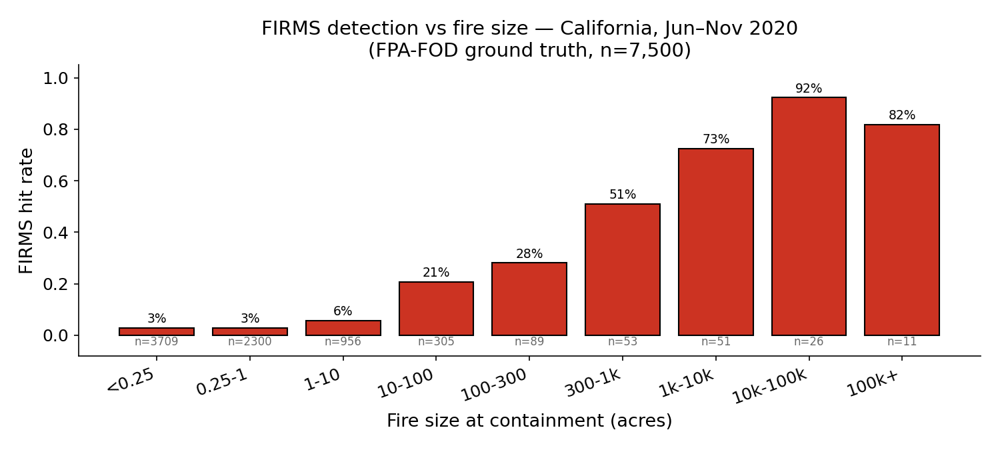

# California wildfire detection gap

How often satellite-based wildfire detection (NASA FIRMS / VIIRS VNP14) fails in California, by fire size and location. The repo measures the gap; it does not pick what fills it.

## Headline

**97% of California wildfires contained under 10 acres never produce a single FIRMS detection.**

| Fire size at containment | n | FIRMS detection rate |
|---|---:|---:|
| < 10 acres (92.5% of all CA fires) | 6,939 | **3.2%** |
| 10–1,000 acres | 472 | 25.2% |
| ≥ 1,000 acres | 89 | 79.8% |

Ground truth: FPA-FOD v6, California, June–November 2020 (n = 7,500 fires). Detection product: FIRMS VIIRS VNP14 (Suomi-NPP, archived `_SP`).



## Full write-up

**→ [`memo/firms_findings.pdf`](memo/firms_findings.pdf)** — 12 pages.

Covers: methodology, envelope sensitivity, polygon-vs-centroid matching, per-fold model uncertainty bands, calibration, the cause-mix-weighted gap surface, detection latency (median ~7 hours from alarm for the subset VIIRS catches at all), and honest limitations (single-year, single-region; trust the size finding, not yet the spatial specifics).

## Reproduce

```bash
echo "FIRMS_MAP_KEY=<your key>" > .env   # get a key at https://firms.modaps.eosdis.nasa.gov/api/
pip install -r requirements.txt

# data acquisition
python -m src.fetch_firms       # FIRMS VIIRS, ~37 API calls
python -m src.fetch_calfire     # CAL FIRE incidents JSON
python -m src.fetch_fpafod      # FPA-FOD SQLite (~214 MB)
python -m src.fetch_perimeters  # NIFC burn-perimeter polygons
python -m src.fetch_elevation   # Open-Elevation lookups
python -m src.terrain           # slope / aspect / TPI
python -m src.fetch_fuel        # LANDFIRE FBFM40

# analysis
python -m src.compare_v1                 # centroid+radius hit/miss + sensitivity sweep
python -m src.perimeter_hits             # polygon-based hit/miss
python -m src.latency                    # perimeter-anchored detection latency
python -m src.swath_analysis             # FIRMS scan*track stratification

# modeling
python -m src.baselines
python -m src.model                      # v1 calibrated GBM
python -m src.model_v2                   # v2 adds elevation
python -m src.model_v3                   # v3 adds slope/aspect/TPI + LANDFIRE fuel
python -m src.metrics_uncertainty        # per-fold uncertainty bands
python -m src.reliability_v2_v3          # reliability bins for v2 + v3
python -m src.gap_surface_v3_unbiased    # cause-mix-weighted gap surface

# figures + memo PDF
python -m src.plots
python -m src.render_memo_pdf            # needs ~/bin/pandoc and ~/bin/tectonic
```

## Layout

```
src/                  pipeline (data acquisition → analysis → modeling → figures)
data/raw/             source files (gitignored, regeneratable)
data/processed/       parquet artifacts (gitignored, regeneratable)
figures/              PNGs referenced by the memo + README
memo/                 the 12-page write-up (markdown source + rendered PDF)
format_guide.md       lessons from getting pandoc + tectonic to render at arXiv quality
whats_next.txt        v2 punch list (pulled from the memo before publication)
```

## Honest caveats (read these before quoting any number)

- **Single year, single region.** 2020 was an outlier lightning-siege year for CA. The size-by-detection finding is sensor physics and is robust; the *spatial* gap-surface specifics (Klamath / Sierra hot-zones) partly reflect where 2020 happened to burn and should not drive any operational decision until the pipeline replicates on Oregon and Idaho.
- **"Hit" means "any FIRMS pixel within 3 km / +1 day," not "FIRMS correctly identified this fire."** Two fires within a few km can both be credited as hits in the centroid-radius envelope; the polygon-matched subset is the stricter measurement and is reported separately.
- **The 97% combines sensor miss with overpass-sampling miss.** Suomi-NPP gives a given CA point 1–2 distinct overpasses per day; a 90-minute grass fire between overpasses produces no detection regardless of sensor sensitivity. Operationally these collapse into the same gap; the framing matters for any "the sensor is bad" narrative.
- **This memo does not compare the options for closing the gap.** Ground-based camera networks (ALERTCalifornia), lookout towers, manned patrol aircraft, public-reporting routing, and autonomous loiter platforms are all candidates and none is evaluated against the others here. The work measures the hole; choosing the fill is downstream.
- **The LANDFIRE fuel feature is suspect on inspection.** 61% of FPA-FOD ignitions snap to non-burnable LANDFIRE cells because human-caused fires cluster in the urban-wildland interface. The v3 (terrain+fuel) null result may be a bad-feature null rather than a no-signal null.
- **All other caveats are in the memo's "Honest limitations" section.**

## Data attributions

- FIRMS data: NASA FIRMS, public.
- FPA-FOD: Short, Karen C. 2022. *Spatial wildfire occurrence data for the United States, 1992–2020 [FPA_FOD_20221014]* (6th Edition). Forest Service Research Data Archive. RDS-2013-0009.6.
- Burn perimeters: NIFC InterAgency Fire Perimeter History.
- CAL FIRE incidents: CAL FIRE public incident feed.
- Fuel models: LANDFIRE LF2016 FBFM40 CONUS, USGS-hosted ImageServer.
- Elevation: Open-Elevation public API, SRTM-derived.
