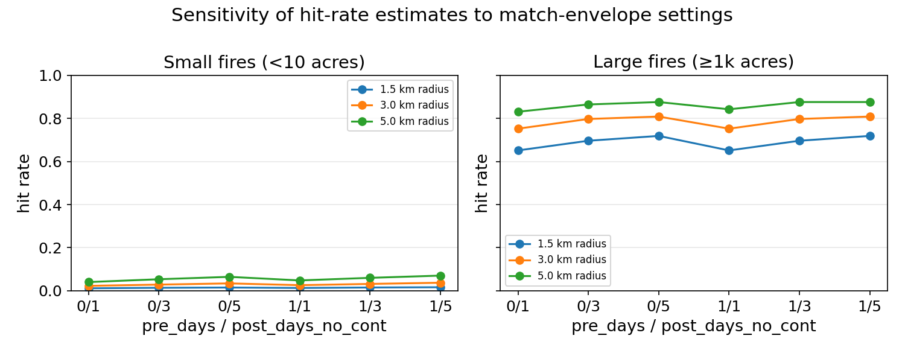
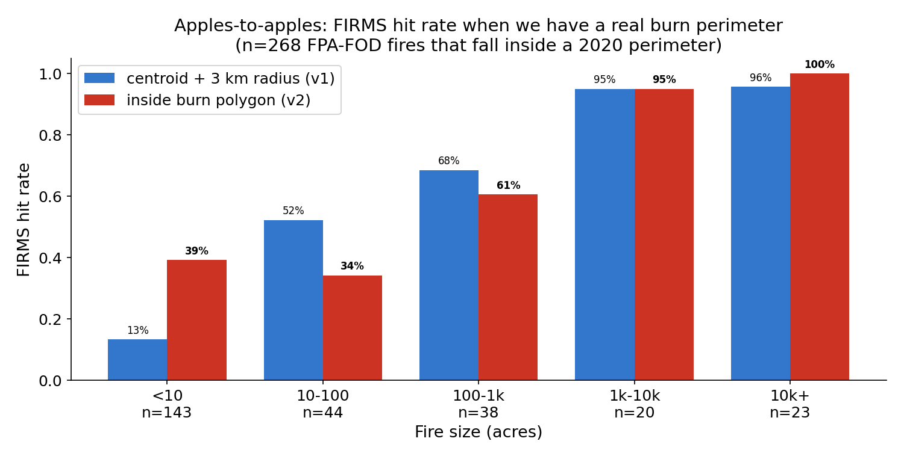
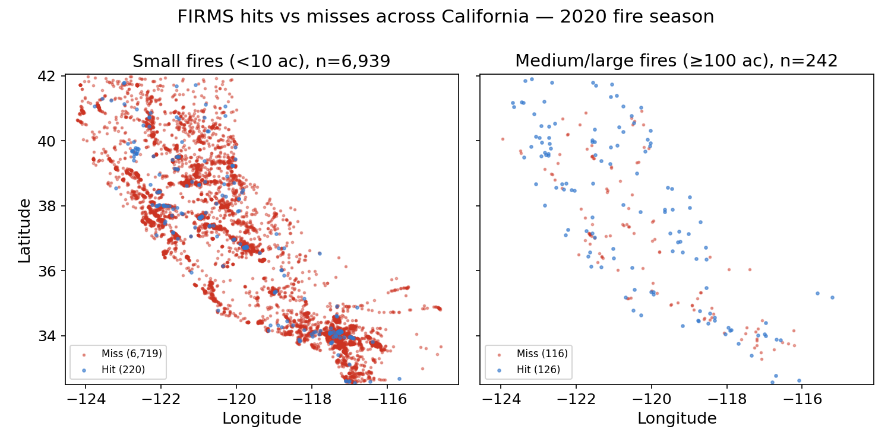

# Headline finding

A California wildfire that gets contained under 10 acres has a **\~97% probability of never producing a coincident FIRMS detection**. For a drone product that closes the resulting gap, the conflation below is fine; for a "satellite detection fails" narrative, it is over-claiming and needs unpacking.

| Fire size at containment | n | FIRMS detection rate |
|---|---:|---:|
| **\< 10 acres** (92.5% of all CA fires) | 6,939 | **3.2%** |
| 10--1,000 acres | 472 | 25.2% |
| ≥ 1,000 acres | 89 | 79.8% |

Ground truth: FPA-FOD v6 (Short 2022, RDS-2013-0009.6) restricted to California, June--November 2020 (n = 7,500 fires). Detection product: FIRMS VIIRS VNP14 (Suomi-NPP, archived `_SP` source, 233,261 pixel detections).

**What "miss" actually means here, and what it does not.** The 97% combines two distinct failure modes that this version of the analysis does not separate:

1. *Sensor miss.* VIIRS overpassed the fire while it was burning and the thermal signal was too weak or too brief to fire a pixel.
2. *Temporal sampling miss.* VIIRS did not overpass the fire while it was burning. Suomi-NPP is a single sun-synchronous satellite (one day + one night equator crossing); at California latitudes a given point gets typically 1--2 distinct overpasses per 24 h. A 90-minute grass fire between overpasses produces no detection regardless of sensor sensitivity.

Both fail the same way from a "did the satellite alert us?" standpoint, and a loitering drone closes both. But the framing matters: the headline is *not* "VIIRS sensors are bad at small fires" — it is "satellites do not alert on small CA fires, for some combination of sensor sensitivity and overpass timing." Separating those would require joining per-fire ignition--containment windows to VIIRS overpass timetables, which is in the next-steps queue.

**A second caveat that compounds the first.** Fire size at containment is an *outcome*, and detection is a predictor of that outcome — fires that get detected get suppressed faster and stay smaller. So "small fires get missed" and "missed fires stay small" are partly the same arrow, viewed from two sides. The 97% measurement is still correct; the causal phrasing "FIRMS misses *because* fires are small" is not fully defensible from this data alone.

{ width=100% }

# Decision impact

The question has the same answer for both plausible product directions:

- **Loiter / early detection.** Marginal value of a drone over a square kilometer is approximately the satellite-miss probability at that location:

    $$\text{marginal aerial value}(x) \;=\; 1 - P\!\left(\text{FIRMS detects} \mid x\right).$$

    The gap surface (Figure 8) is a first-pass priority map for where to base or patrol assets.

- **Active suppression.** Suppression needs a *trustworthy* ignition trigger. FIRMS does not emit an all-clear signal — it emits silence. But silence is exactly what a triggering pipeline would have to interpret as "no fire here." Given that 97% of CA small fires produce no FIRMS pixel, treating FIRMS silence as evidence of no fire has a ~97% miss rate at the small-fire end. The same gap surface is the surface over which a confirmatory aerial layer must operate.

In both cases the foundation is identical: a calibrated estimate of the satellite miss probability,

$$P_{\text{miss}}(x) \;=\; 1 - P\!\left(\text{FIRMS detects fire} \,\big|\, \text{size, location, season, time-of-day}\right).$$

# Methodology robustness

The headline picture is robust to envelope settings. The default match envelope is 3 km radius, +1 day from discovery through `min(CONT_DATE, DISCOVERY_DATE + 14d)`. Sweeping radius across $\{1.5, 3, 5\}$ km and post-days across $\{1, 3, 5\}$:

{ width=100% }

Even at the most generous setting (5 km radius, +5 day window), small-fire hit rate caps at 7%; the tightest setting (1.5 km, +1 day) still shows large fires (≥ 1k ac) at 65--72%. The bias is not an artifact of envelope choice.

# Polygon vs.\ centroid matching

For the 268 FPA-FOD fires that fall inside a 2020 NIFC burn perimeter, we can replace "FIRMS pixel within 3 km of discovery point" with "FIRMS pixel inside the actual burn polygon during the fire's active window." This isolates the cost of the centroid-radius approximation.

{ width=92% }

| Size (acres) | $n$ inside perim | centroid+radius | polygon | $\Delta$ |
|---|---:|---:|---:|---:|
| \< 10 | 143 | 13% | **39%** | $+26$ pp |
| 10--100 | 44 | 52% | 34% | $-18$ pp |
| 100--1k | 38 | 68% | 61% | $-8$ pp |
| 1k--10k | 20 | 95% | 95% | $0$ |
| 10k+ | 23 | 96% | **100%** | $+4$ pp |
| **All** | **268** | **41%** | **51%** | $+10$ pp |

Two opposite effects fight each other. At the **middle bucket (10--1k acres)**, the polygon method is *stricter*: the centroid envelope was over-crediting hits from nearby fires whose pixels happened to lie within 3 km but weren't actually inside this fire's polygon. At the **top end**, the polygon method recovers the Castle-Fire-style cases where the FPA-FOD coordinate is offset ~130 km from the actual burn (96% → 100%).

The **small end (<10 ac) jump from 13% → 39% is the least trustworthy cell in the table** and should not be read as "polygon matching shows FIRMS actually catches small fires four times more often than we thought." What is mostly happening here: a 1-acre ignition sits inside a mega-fire's eventual burn polygon, the mega-fire fires hundreds of FIRMS pixels over its multi-week active period, and the small fire gets credited as "detected" because of pixels that are almost certainly from the mega-fire, not from the 1-acre ignition itself. The temporal-window filter (each small fire is matched only to FIRMS pixels within its own discovery + 14 day window) cuts the worst of this, but it does not fully separate small-fire detection from mega-fire detection inside a shared polygon. Read this cell as an upper bound on small-fire detection within the polygon-overlapping subset, not as evidence of substantive small-fire detection.

Net effect: $+10$ pp lift on the polygon-matchable subset. The headline tables use the centroid-radius numbers across the full 7,500 fires for comparability with the prior literature; the polygon match is the more trustworthy measurement when a perimeter exists.

**A reader will notice the headline says small fires are detected 3.2% of the time and this table says 39%, and that needs reconciling explicitly.** These two numbers are not in conflict, because the populations are different: the 3.2% is over **all 6,939 small CA fires in 2020**, while the 39% is over the **143-fire subset of small fires that happened to fall inside a 2020 burn perimeter**. That subset is heavily selected — it is mostly small fires that ignited inside what became a mega-fire's eventual footprint, where (as flagged above) the detection credit may belong to the mega-fire's pixels. The 3.2% is the right number for the addressable-market read; the 39% is a methodology-comparison number, not a substitute for it.

# Detection latency, when FIRMS does see the fire

Hit/miss is only half the picture. For the perimeters where FIRMS *does* fire, the operationally meaningful number is **how late**. We spatial-join FIRMS pixels with the 566 CA 2020 burn perimeters (NIFC), anchor each perimeter's fire-start time to the matched CAL FIRE incident `Started` timestamp (hour-precision; fallback to FPA-FOD discovery only when name-matched), and contamination-filter any perimeter whose first FIRMS pixel sits **either more than 30 days after the recorded start, or more than 24 hours before it** (the asymmetry is by design: large +30 d gaps almost always indicate an unrelated earlier fire inside what later became this perimeter, but a FIRMS pixel firing >24 h before a CAL FIRE alarm is also suspicious — both directions are dropped, but the negative-side threshold is tighter than the positive).

Of the 110 measurable perimeters, **68 anchor to CAL FIRE's `Started` timestamp** (hour-precision; the trustworthy half), and **42 anchor to FPA-FOD `DISCOVERY_DATE`** (midnight-UTC truncation, up to ±24 h of clock noise). Reporting both:

| Statistic | CAL-FIRE anchor (n=68) | FPA-FOD only (n=42) | Pooled (n=110) |
|---|---:|---:|---:|
| Median latency, hours from alarm to first FIRMS pixel | **7.0** | 33.8 | 15.8 |
| Inter-quartile range | 5.4 -- 15.8 | 20.6 -- 78.8 | 6.5 -- 31.7 |
| Detected within 12 h | 62% | 12% | 43% |
| Detected within 24 h | 96% | 33% | 72% |
| Detected after $>$ 48 h | 0% | 29% | 11% |

{ width=100% }

**The 7 h figure is not a population latency estimate. Read it carefully or don't quote it.** The CAL-FIRE-anchored subset is filtered twice in the direction of fires VIIRS handles well: (a) FIRMS had to fire a pixel inside the perimeter at all, and (b) the fire had to be notable enough that CAL FIRE published an incident record with an `Started` timestamp. Both filters select toward exactly the same sub-population — fires that grew into the multi-hundred-acre-plus regime. So:

- The 7 h median is best understood as a **latency floor for the easiest sub-population** — large, notable, already-burning, in CAL FIRE's incident database. It is not the latency anyone operationally interesting (a small early ignition) would experience.
- For the small-fire 92.5% the memo's headline is about, the right number is the 97% non-detection figure, not 7 h. There is no detection to time for the fires that matter most.
- The 15.8 h pooled median has the same survivorship issue plus extra noise from FPA-FOD date-truncation. It is not a better number than 7 h; it is the same conditional number with more noise.

For the size/latency relationship *inside the catchable subset*, latency increases slightly with perimeter size (median 9 h for 10--100 ac → 21 h for 10k+ ac, pooled). The expected dynamic: a fire that ends at 10k acres started as a sub-VIIRS-detection-threshold ignition and only crossed the detection threshold after substantial growth.

**Implication for a loiter-aircraft pitch:** lean on the 97% non-detection figure, not the 7 h figure. 7 h sounds almost tolerable on a quick read and undersells the case; the 97% is the actual operational gap a drone closes.

# Swath-edge geometry --- pixel size matters

VIIRS scans a ~3,000 km swath. Pixels near nadir are ~375 m on a side; pixels near the swath edge are 2--3× larger. FIRMS exposes this via the `scan` and `track` fields:

$$\text{pixel\_area}\;[\text{km}^2] \;\approx\; \text{scan} \times \text{track}.$$

We split FIRMS into nadir / mid / edge thirds by pixel area (33rd and 66th percentiles of the season's distribution) and re-ran the hit-rate calculation restricted to each:

{ width=100% }

- **Big fires (≥ 1k ac):** edge pixels have a *higher* hit rate (1k--10k: 47% nadir vs **61% edge**; 10k+: 76% vs **81%**). A larger pixel covers more area, so any given fire is more likely to fall under one.
- **Small fires ($<$ 10 ac):** edge pixels have a *lower* hit rate (1% vs 2%). The same physics that helps for big fires hurts here: larger pixels have a higher per-pixel detection threshold.

This is the textbook detection-vs-resolution trade-off, visible in the data without any model. For an aerial product, it implies that nadir-only filtering *tightens* the FIRMS "no" signal but throws away ~70% of detections; for small-fire alerting, ignoring edge pixels is the right call because they contribute almost nothing.

# Modeling the gap

Target:

$$\hat P\!\left(\text{FIRMS detects fire} \,\Big|\, \text{size, lat, lon, DOY, time-of-day, terrain, fuel}\right).$$

All metrics are computed *per fold* on a 5-fold stratified split (same `RNG=0` as the OOF predictions); reported as **mean ± standard deviation across the five held-out folds** (except the deterministic baselines, noted below). The calibrated rows in the table below all use isotonic `CalibratedClassifierCV(cv=5)`; "(cal)" is omitted in their row labels for brevity.

| Model | Brier $\downarrow$ | Log-loss $\downarrow$ | AUC $\uparrow$ |
|---|---:|---:|---:|
| Constant: predict no | 0.0547 ± 0.0000 | 0.755 ± 0.000 | 0.500 |
| Train base rate | 0.0517 ± 0.0000 | 0.212 ± 0.000 | 0.500 |
| Size-class lookup | 0.0418 ± 0.0014 | 0.171 ± 0.006 | 0.725 ± 0.040 |
| Size-class × lat-band | 0.0422 ± 0.0017 | 0.192 ± 0.015 | 0.753 ± 0.020 |
| Logistic regression | 0.0421 ± 0.0013 | 0.171 ± 0.006 | 0.771 ± 0.026 |
| GBM v1 | 0.0381 ± 0.0012 | 0.152 ± 0.005 | 0.838 ± 0.029 |
| **GBM v2 (+\ elevation)** | **0.0367 ± 0.0017** | **0.148 ± 0.006** | **0.843 ± 0.017** |
| GBM v3 (+\ terrain + fuel) | 0.0370 ± 0.0013 | 0.148 ± 0.004 | 0.844 ± 0.017 |

`constant_no` and `base_rate` show 0.0000 std because they are deterministic on the same data; Brier is pooled across folds but does not depend on fold structure. The Brier of "predict no" equals the empirical positive rate (0.0547). The log-loss spike from 0.212 ("predict base rate") to 0.755 ("predict no") is purely a calibration penalty for putting probability mass at zero when the truth is sometimes one. Brier and log-loss do not disagree on whether the model is useful, only on whether it is *calibrated*.

\clearpage

{ width=100% }

\clearpage

The size-class baseline is strong; it captures the dominant signal (small fires get missed). The v1 GBM clears it cleanly: Brier 0.0381 ± 0.0012 vs 0.0418 ± 0.0014, AUC 0.838 ± 0.029 vs 0.725 ± 0.040. The continuous features (size, lat/lon, season, time-of-day) buy real lift.

The `hours_since_overpass` feature was included in the v1 spec but is built on a hardcoded 02:00 / 14:00 local schedule and is NaN for ~22% of records (those without FPA-FOD `DISCOVERY_TIME`). Because the feature is low-fidelity by construction, we ran an explicit ablation: a v1 GBM with `hours_since_overpass` removed. The ablated model is **not worse** — Brier 0.0370 ± 0.0010, log-loss 0.149 ± 0.004, AUC 0.840 ± 0.022 — actually a touch better than the full v1 on Brier, indistinguishable on AUC. The lift over the size-class baseline survives the ablation cleanly. So the "continuous features buy real lift" claim is safe; the lift comes from `log_size`, `LATITUDE`, `LONGITUDE`, and the `sin_doy`/`cos_doy` seasonality, not from the hardcoded overpass schedule.

**v2 (+ elevation) and v1 are statistically indistinguishable on this dataset.** Brier 0.0367 ± 0.0017 vs 0.0381 ± 0.0012 — a 0.0014 gap with ±1σ bands that overlap. Either model is defensible as headline; we keep v2 nominal because elevation is a sensible physical predictor of detection probability and the point estimate is the right side of v1, but a sceptical reader is entitled to call this a coin flip on the metric. (We avoid the otherwise-tempting argument "v2's gap surface looks more terrain-shaped, therefore v2 is better." A model can produce more spatially-structured output because it is picking up real signal *or* because it is overfitting to elevation; the held-out metric does not distinguish those, so neither do we.)

**The v3 vs v2 comparison is a null result, and that is the honest read.** Brier 0.0370 ± 0.0013 vs 0.0367 ± 0.0017 and AUC 0.844 ± 0.017 vs 0.843 ± 0.017 — the differences are an order of magnitude smaller than the fold-to-fold standard deviations. Adding slope, aspect, TPI, and LANDFIRE fuel produced no detectable improvement on this single-year sample. Four readings are consistent with the data:

1. The features really are collinear with lat/lon/elevation, and there is no extra signal to extract.
2. There is signal, but 7,500 fires in one year is not enough sample to resolve it.
3. The information is there but the GBM hyperparameters were not retuned for the larger feature set.
4. **The LANDFIRE feature, as ingested, is degenerate for this dataset.** 61% of FPA-FOD ignitions snap to a non-burnable LANDFIRE FBFM40 cell (codes 91--99: urban, developed, agricultural, barren), because human-caused ignitions cluster in the wildland-urban interface where the 30 m raster classifies the actual ignition pixel as built environment. A "fuel" feature that's mostly "Non-burnable" cannot teach the model much.

We cannot distinguish (1)--(4) here. The honest claim is "v3 added features that did not move the metric on this sample, and at least one of those features (fuel) is suspect on inspection" — not "terrain and fuel don't help." The right next test for the fuel question is to sample LANDFIRE on a 100 m neighborhood mode rather than the nearest-cell value, or to restrict v3 to lightning-cause ignitions where the WUI-snap problem doesn't apply.

![Reliability diagram, 10 bins on OOF predictions, all four calibrated models. Calibration is mixed in the operational range: in the 10--20% predicted-probability bin, GBM v2 *over*-predicts hit rate by ~4 pp (the unsafe direction for a detection product — model says fire more likely caught than it is); in the 30--60% bins it *under*-predicts by 8--16 pp (the safer direction). The 0--10% bin (where ~90% of fires live) is well-calibrated to within 1 pp. Bins above 70% have ≤35 fires each and are data-limited.](../figures/calibration.png){ width=72% }

# Where the gap is largest

For a hypothetical fire ignited at peak season (mid-July, mid-day local), we evaluate

$$g(x) \;=\; \sum_{c} \pi_c \cdot \bigl[1 - \hat P\!\left(\text{FIRMS detects} \,\big|\, \text{1-acre fire},\, \text{July 15},\, \text{11:00 local},\, \text{cause}=c,\, x\right)\bigr]$$

on a 0.1° latitude/longitude grid covering California, where $x$ is the cell's spatial / terrain / fuel context and $\pi_c$ is the empirical 2020 CA cause distribution (56% undetermined, 11% arson, 9% equipment, 8% lightning/Natural, ...). The earlier version of this analysis conditioned on $c=\text{Natural}$ alone, which over-represented lightning-dominated terrain (Klamath / Sierra); the cause-mix-weighted version below is the right read.

{ width=100% }

The 1-acre map is uniformly high (median 0.98) --- VIIRS rarely catches small fires anywhere. **The lever is detecting fires that haven't grown yet.** The morning vs.\ afternoon 1-acre panels are nearly identical (median gaps 0.97 vs.\ 0.98); the model finds no operationally meaningful time-of-day effect at this size, so both panels are kept here only to show that the headline is not a single-scenario artifact.

For 100-acre fires the surface separates by terrain: the Klamath / Trinity Alps and the northern Sierra--Cascades show high gap (FIRMS will probably miss), while the Central Valley and southern basins show low gap (FIRMS catches them). Detection failures concentrate in the heavily forested, high-elevation interior --- exactly where ground-based detection is also hardest.

**Trust the size finding; do not yet trust the spatial specifics.** 2020 was an outlier lightning-siege year for California — most of the season's big fires concentrated in the northern interior. The "FIRMS misses small fires" headline is a sensor-physics result and is almost certainly universal. The shape of the 100-acre gap surface, in contrast, partly reflects *where 2020 happened to burn*, and the Klamath / Sierra story should not be used as a basing decision until the same pipeline is run on Oregon and Idaho, or on a 5+ year CA window, and the spatial structure replicates. A founder reading Figure 8 to choose where to position aircraft is reading exactly the layer this dataset cannot defend yet.

{ width=100% }

# Honest limitations

- **"Hit" = any pixel in the envelope** (or polygon), not "FIRMS correctly identified *this* fire." Two fires burning within a few km can both be credited as hits.
- **FPA-FOD coordinates are noisy.** The 174k-acre Castle Fire (2020) shows up at 34.95$^\circ$N / -118.93$^\circ$W, ~130 km from the actual burn perimeter in Sequoia NF. The polygon-match approach above resolves this case; centroid-radius cannot.
- **FPA-FOD covers 1992--2020 only.** Extending past 2020 requires a different ground-truth source (MTBS, ICS-209, or CAL FIRE perimeters).
- **Elevation feature is from a ~500 m neighbor offset on SRTM via Open-Elevation**, not a proper 30 m USGS 3DEP raster. The slope estimates are fine for "is it mountainous"; coarse for "is this a steep canyon."
- **Single-year, single-region — the load-bearing caveat.** 2020 was an outlier lightning-siege year for California; most of the season's burned acreage concentrated in the northern interior. The size-by-detection-rate finding (3.2% / 25% / 80%) is a sensor-physics result and is robust. The *spatial* gap-surface specifics — the Klamath / Sierra / Trinity hot-zones in Figure 8 — partly reflect where 2020 happened to burn and should not be acted on (e.g.\ for aircraft basing) until the pipeline replicates on Oregon and Idaho or on a 5+ year CA window.

